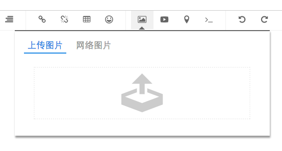

# WangEditor点击按钮直接弹出选择文件窗口，不显示下拉框的插件开发


如果你要的就是这样不显示这个下拉框




直接跳出这个窗口


问题详情可以看

https://github.com/wangfupeng1988/wangEditor/issues/272


```js
(function() {

    // 获取 wangEditor 构造函数和 jquery

    var E = window.wangEditor;

    var $ = window.jQuery;

    // 用 createMenu 方法创建菜单

    E.createMenu(function(check) {

        // 定义菜单id，不要和其他菜单id重复。编辑器自带的所有菜单id，可通过『参数配置-自定义菜单』一节查看

        var menuId = 'uploadimg';

        // check将检查菜单配置（『参数配置-自定义菜单』一节描述）中是否该菜单id，如果没有，则忽略下面的代码。

        if (!check(menuId)) {

            return;

        }

        // this 指向 editor 对象自身

        var editor = this;

        var lang = editor.config.lang;

        var config = editor.config;

        var uploadImgUrl = config.uploadImgUrl;

        var uploadTimeout = config.uploadTimeout;

        var event;

        // 创建 menu 对象

        var menu = new E.Menu({

            editor: editor, // 编辑器对象

            id: menuId, // 菜单id

            title: '图片', // 菜单标题

            // 正常状态和选中状态下的dom对象，样式需要自定义

            $domNormal: $('<i class="wangeditor-menu-img-picture"></i>'),

            $domSelected: $('<i class="wangeditor-menu-img-picture"></i>')

        });

        var upfile = new E.UploadFile({

            editor: editor,

            uploadUrl: uploadImgUrl,

            timeout: uploadTimeout,

            fileAccept: 'image/*'    // 只允许选择图片 

        });

        // 构造函数

        var UploadFile = function (opt) {

            this.editor = opt.editor;

            this.uploadUrl = opt.uploadUrl;

            this.timeout = opt.timeout;

            this.fileAccept = opt.fileAccept;

            this.multiple = true;

        };

        UploadFile.fn = UploadFile.prototype;

        // clear

        UploadFile.fn.clear = function () {

            this.$input.val('');

            E.log('input value 已清空');

        };

        // 渲染

        UploadFile.fn.render = function () {

            var self = this;

            if (self._hasRender) {

                // 不要重复渲染

                return;

            }

            E.log('渲染dom');

            var fileAccept = self.fileAccept;

            var acceptTpl = fileAccept ? 'accept="' + fileAccept + '"' : '';

            var multiple = self.multiple;

            var multipleTpl = multiple ? 'multiple="multiple"' : '';

            var $input = $('<input type="file" ' + acceptTpl + ' ' + 'capture="camera" '+  multipleTpl + '/>');

            var $container = $('<div style="visibility:hidden; display:none;"></div>');

            $container.append($input);

            E.$body.append($container);

            // onchange 事件

            $input.on('change', function (e) {

                self.selected(e, $input.get(0));

            });

            // 记录对象数据

            self.$input = $input;

            // 记录

            self._hasRender = true;

            self.$input.click();

        };


        // 选择

        UploadFile.fn.selectFiles = function () {

            var self = this;

            E.log('使用 html5 方式上传');

            // 先渲染

            self.render();

            // 选择

            E.log('选择文件');

            self.$input.click();

        };

        // 选中文件之后

        UploadFile.fn.selected = function (e, input) {

            var self = this;

            var files = input.files || [];

            if (files.length === 0) {

                return;

            }

            E.log('选中 ' + files.length + ' 个文件');

            // 遍历选中的文件，预览、上传

            $.each(files, function (key, value) {

                self.upload(value);

            });

        };


        // 上传单个文件

        UploadFile.fn.upload = function (file) {

            var self = this;

            var editor = self.editor;

            var filename = file.name || '';

            var fileType = file.type || '';

            var uploadImgFns = editor.config.uploadImgFns;

            var onload = uploadImgFns.onload;

            var ontimeout = uploadImgFns.ontimeout;

            var onerror = uploadImgFns.onerror;

            var reader = new FileReader();

            if (!onload || !ontimeout || !onerror) {

                E.error('请为编辑器配置上传图片的 onload ontimeout onerror 回调事件');

                return;

            }

            E.log('开始执行 ' + filename + ' 文件的上传');

            // 清空 input 数据

            function clearInput() {

                self.clear();

            }

            // onload事件

            reader.onload = function (e) {

                E.log('已读取' + filename + '文件');

                var base64 = e.target.result || this.result;

                editor.xhrUploadImg({

                    event: e,

                    base64: base64,

                    fileType: fileType,

                    name: 'wangEditorH5File',

                    loadfn: function (resultText, xhr) {

                        clearInput();

                        // 执行配置中的方法

                        var editor = this;

                        onload.call(editor, resultText, xhr);

                    },

                    errorfn: function (xhr) {

                        clearInput();

                        if (E.isOnWebsite) {

                            alert('wangEditor官网暂时没有服务端，因此报错。实际项目中不会发生');

                        }

                        // 执行配置中的方法

                        var editor = this;

                        onerror.call(editor, xhr);

                    },

                    timeoutfn: function (xhr) {

                        clearInput();

                        if (E.isOnWebsite) {

                            alert('wangEditor官网暂时没有服务端，因此超时。实际项目中不会发生');

                        }

                        // 执行配置中的方法

                        var editor = this;

                        ontimeout(editor, xhr);

                    }

                });

            };

            // 开始取文件

            reader.readAsDataURL(file);

        };

        // 菜单正常状态下，点击将触发该事件

        menu.clickEvent = function(e) {

            upfile.selectFiles();

        };

        // 增加到editor对象中

        editor.menus[menuId] = menu;

    });

})();
```

上面的扩展能解决使用内部方式上传的问题，但是在自定义上传的时候会报错。
我就不去截图了， 我已经没使用这个方式了。


**我用的是WangEditer2**


我用最简单的方式解决了这个问题。虽然对于有代码追求的人不喜欢这样的方式。但是也是乐的其中，不然你去看9000 行代码？


修改如下 函数就可以

```js
Menu.fn.activeStyle = function (active) {
            var selected = this.selected
            var $dom = this.$domNormal
            var $domSelected = this.$domSelected

            if (active) {
                $dom.addClass('active')
                $domSelected.addClass('active')

                if(this.id === 'img'){
                    $('.wangEditor-drop-panel').css('display','none')
                    setTimeout(function () {
                        $('.upload-icon-container').click()
                    }, 0)
                }

            } else {

                $dom.removeClass('active')
                $domSelected.removeClass('active')
            }

            // 记录状态 （ menu hover 时会取状态用 ）
            this.active(active)
        }
```


如有更优雅的方式请斧正！