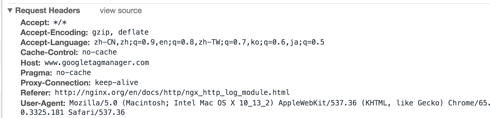

# Nginx 日志 log_format

## 1.Nginx 日志类型

#### error.log
所有错误的http状态和服务的错误信息

#### access_log
Nginx 每一次请求的访问状态

## log_format 配置语法

    Syntax:	access_log path [format [buffer=size] [gzip[=level]] [flush=time] [if=condition]];
    access_log off;
    Default:	
    access_log logs/access.log combined;
    Context:	http, server, location, if in location, limit_except
    
    
Syntax 配置语法
Context 只的是配置在哪个模块下面
## 示例

    #user liujunbin staff ;
    worker_processes  8;
    
    //这里配置 err_log
    #error_log  logs/error.log;
    #error_log  logs/error.log  notice;
    error_log  logs/error.log  info;
    
    #pid        logs/nginx.pid;
    
    
    
    events {
        worker_connections  1024;
    }
    
    
    http {
            include       mime.types;
            default_type  application/octet-stream;
        
            //这些是默认的配置
            //$remote_addr 客户端地址
            //$remote_user 客户端的认证的用户名， 默认不开启
            //$time_local nginx 的时间
            //$request 表示http 的请求头
            //$status 表示response 返回的状态
            //$body_bytes_sent reponse 响应的大小
            //$http_referer 表示 refer 来源 
            //$http_user_agent 标准的http 头信息， 表示客户端的访问工具
            //$http_x_forwarded_for 记录每一级用户http 请求携带的http 信息
            log_format  main  '$remote_addr - $remote_user [$time_local] "$request" '
                              '$status $body_bytes_sent "$http_referer" '
                              '"$http_user_agent" "$http_x_forwarded_for"';
        
            //main 表示以main的格式记录
            access_log  logs/access.log  main;
        
            sendfile        on;
            #tcp_nopush     on;
        
            #keepalive_timeout  0;
            keepalive_timeout  65;
        
            #gzip  on;
        }

nginx -V

    nginx version: nginx/1.8.0
    built by clang 6.1.0 (clang-602.0.49) (based on LLVM 3.6.0svn)
    built with OpenSSL 1.0.2a 19 Mar 2015 (running with OpenSSL 1.0.2n  7 Dec 2017)
    TLS SNI support enabled
    configure arguments: --prefix=/usr/local/Cellar/nginx/1.8.0 --with-http_ssl_module --with-pcre --with-ipv6 --sbin-path=/usr/local/Cellar/nginx/1.8.0/bin/nginx --with-cc-opt='-I/usr/local/Cellar/pcre/8.36/include -I/usr/local/Cellar/openssl/1.0.2a-1/include' --with-ld-opt='-L/usr/local/Cellar/pcre/8.36/lib -L/usr/local/Cellar/openssl/1.0.2a-1/lib' --conf-path=/usr/local/etc/nginx/nginx.conf --pid-path=/usr/local/var/run/nginx.pid --lock-path=/usr/local/var/run/nginx.lock --http-client-body-temp-path=/usr/local/var/run/nginx/client_body_temp --http-proxy-temp-path=/usr/local/var/run/nginx/proxy_temp --http-fastcgi-temp-path=/usr/local/var/run/nginx/fastcgi_temp --http-uwsgi-temp-path=/usr/local/var/run/nginx/uwsgi_temp --http-scgi-temp-path=/usr/local/var/run/nginx/scgi_temp --http-log-path=/usr/local/var/log/nginx/access.log --error-log-path=/usr/local/var/log/nginx/error.log --with-http_gzip_static_module        
            
tail -f /usr/local/var/log/nginx/access.log
        
    192.168.0.102 - - [15/Apr/2018:07:52:38 +0800] "GET /myrzx/img/home_img2.png HTTP/1.1" 200 1273 "http://192.168.0.102:8091/myrzx/tuwen" "Mozilla/5.0 (Macintosh; Intel Mac OS X 10_13_2) AppleWebKit/537.36 (KHTML, like Gecko) Chrome/65.0.3325.181 Safari/537.36"
    192.168.0.102 - - [15/Apr/2018:07:52:38 +0800] "GET /myrzx/img/info_class_fixed.png HTTP/1.1" 200 34842 "http://192.168.0.102:8091/myrzx/tuwen" "Mozilla/5.0 (Macintosh; Intel Mac OS X 10_13_2) AppleWebKit/537.36 (KHTML, like Gecko) Chrome/65.0.3325.181 Safari/537.36"
    192.168.0.102 - - [15/Apr/2018:07:52:38 +0800] "GET /myrzx/img/myrzx-logo.png HTTP/1.1" 200 57907 "http://192.168.0.102:8091/myrzx/tuwen" "Mozilla/5.0 (Macintosh; Intel Mac OS X 10_13_2) AppleWebKit/537.36 (KHTML, like Gecko) Chrome/65.0.3325.181 Safari/537.36"
    192.168.0.102 - - [15/Apr/2018:07:52:38 +0800] "GET /myrzx/img/tuwen_menu.png HTTP/1.1" 200 98696 "http://192.168.0.102:8091/myrzx/tuwen" "Mozilla/5.0 (Macintosh; Intel Mac OS X 10_13_2) AppleWebKit/537.36 (KHTML, like Gecko) Chrome/65.0.3325.181 Safari/537.36"
    192.168.0.102 - - [15/Apr/2018:07:52:38 +0800] "GET /myrzx/img/stack_chickena.png HTTP/1.1" 200 4464 "http://192.168.0.102:8091/myrzx/tuwen" "Mozilla/5.0 (Macintosh; Intel Mac OS X 10_13_2) AppleWebKit/537.36 (KHTML, like Gecko) Chrome/65.0.3325.181 Safari/537.36"
    192.168.0.102 - - [15/Apr/2018:07:52:38 +0800] "GET /img/erweima.png HTTP/1.1" 404 570 "http://192.168.0.102:8091/myrzx/main.e336e22ec5a351a2920c.css" "Mozilla/5.0 (Macintosh; Intel Mac OS X 10_13_2) AppleWebKit/537.36 (KHTML, like Gecko) Chrome/65.0.3325.181 Safari/537.36"
    192.168.0.102 - - [15/Apr/2018:07:52:38 +0800] "GET /assets/img/tuwen_bg.png HTTP/1.1" 200 2149150 "http://192.168.0.102:8091/myrzx/main.e336e22ec5a351a2920c.css" "Mozilla/5.0 (Macintosh; Intel Mac OS X 10_13_2) AppleWebKit/537.36 (KHTML, like Gecko) Chrome/65.0.3325.181 Safari/537.36"      
      
      
## log_format是按照 不同的变量组合， nginx 变量有哪些？

nginx 变量主要分为 HTTP 请求变量， 内置变量 ， 自定义变量

#### 1.HTTP 请求变量 

arg_PARAMETER  
http_HEADER
sent_http_HEADER

例如 

比如最后1个，在日志请求中就写 以$调用, 大写全变小写，- 改成 _

log_format main_test '$http_user_agent'
      
      
#### 2.Nginx 内置变量 

      官网地址
      http://nginx.org/en/docs/http/ngx_http_core_module.html#var_status

      